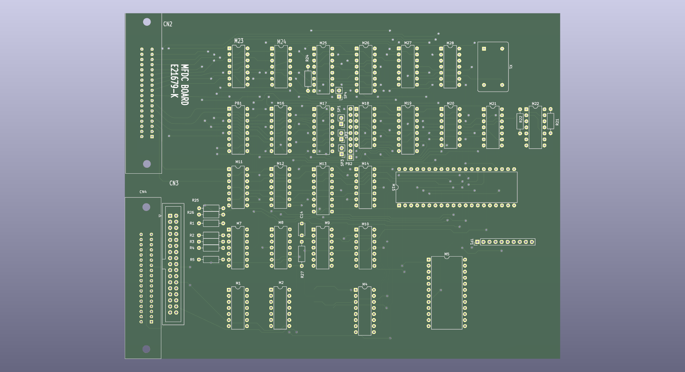

# MB27611_MFDC

**Fujitsu FM-7 Mini Floppy Drive MFDC Board Clone**

## Overview

This project is an attempt at cloning the MFDC (Mini Floppy Disk Controller) board found inside the Fujitsu MB27611 Mini Floppy disk drive. 

## ⚠️ Status: Untested

> [!CAUTION]
> This design has **not been tested** and may contain mistakes. Some components have unknown functions and appear in the schematic as generic ICs. Use this information and design at your own risk.

## Project Features

- **Compatibility:** Designed for the Fujitsu MB27611 Mini Floppy drive.
- **Format:** KiCad project (Schematic and PCB layout included).
- **Libraries:** Custom symbols and footprints are included in the repository.

## Repository Contents

| File/Folder              | Description                        |
|--------------------------|------------------------------------|
| `MB27611_MFDC.kicad_sch` | KiCad Schematic                    |
| `MB27611_MFDC.kicad_pcb` | KiCad PCB Layout                   |
| `MFDC_Library.kicad_sym` | Project-specific symbol library    |
| `MFDCLIB/`               | Project-specific footprint library |
| `MB27611_MFDC.png`       | 3D Render of the PCB               |

## Contributing

If you have information regarding the unknown components or find any errors in the schematic/layout, please feel free to open an issue or submit a pull request.

## License

This project is licensed under the [Creative Commons Attribution 4.0 International License](LICENSE.md).
